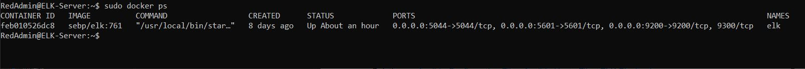
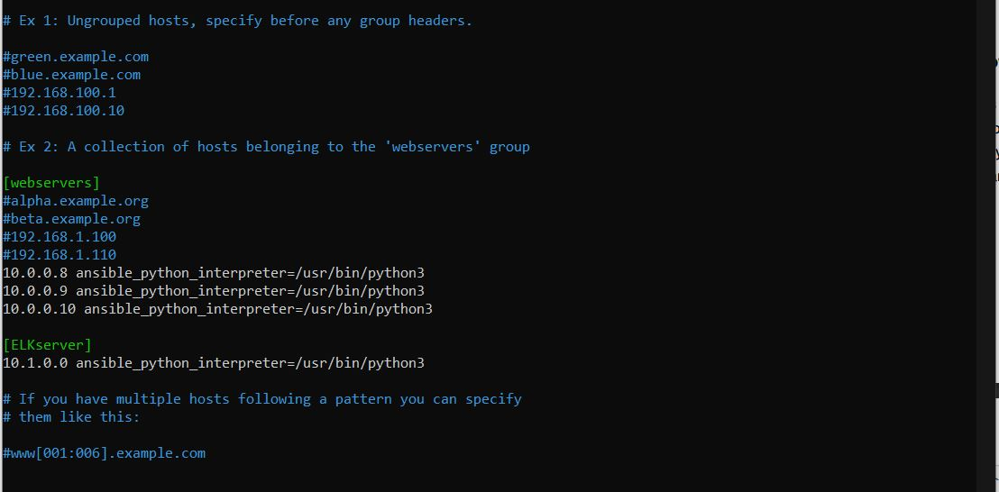

# ELK-Stack-Project
Project 1 - ELK Stack Project
## Automated ELK Stack Deployment

The files in this repository were used to configure the network depicted below.

These files have been tested and used to generate a live ELK deployment on Azure. They can be used to recreate the entire deployment pictured above. Alternatively, select portions of the InstallBeats.sh file may be used to install only certain pieces of it, such as Filebeat.

  -ELK_Playbook.yml
  -filebeat-playbook.yml
  -metricbeat-playbook.yml

This document contains the following details:
- Description of the Topology
- Access Policies
- ELK Configuration
  - Beats in Use
  - Machines Being Monitored
- How to Use the Ansible Build

### Description of the Topology

The main purpose of this network is to expose a load-balanced and monitored instance of DVWA, the D*mn Vulnerable Web Application.

Load balancing ensures that the application will be highly available, in addition to restricting access to the network. Load balancing protects availability by distributing traffic among the three webservers, such that if one or more of the servers goes down, the other(s) immediately step in. We further secure the environment by allowing only access to a Jump Box to configure these webservers. 

Integrating an ELK server allows users to easily monitor the vulnerable VMs for changes to the system files and metrics. Filebeat for example will monitor target log files (such as invalid login attempts) and collect and index via Elasticsearch or Logstash. Metricbeat performs an analgous task for system metrics, such as server processes and system performance.

The configuration details of each machine may be found below.
_Note: Use the [Markdown Table Generator](http://www.tablesgenerator.com/markdown_tables) to add/remove values from the table_.

| Name          | Function     | IP Address  | Operating System |
|---------------|--------------|-------------|------------------|
| Jump Box      | Gateway      | 10.0.0.4    | Linux            |
| Web1          | Web Server   | 10.0.0.8    | Linux            |
| Web2          | Web Server   | 10.0.0.9    | Linux            |
| Web3          | Web Server   | 10.0.0.10   | Linux            |
| ELK-Server    | ELK Server   | 10.1.0.4    | Linux            |
|-              |-             |-            |-                 |
| Load Balancer | Load Balance | 40.83.133.23|                  |

### Access Policies

The machines on the internal network are not exposed to the public Internet. 

Only the Jump Box, ELK-server machines, and Load Balancer can accept connections from the Internet. Access to these machines is only allowed from the following IP addresses:
-73.220.1.143 (or Admin Local IP)

Machines within the network can only be accessed by the Jump Box, at 10.0.0.4.

A summary of the access policies in place can be found in the table below.

| Name      | Publicly Accessible | Allowed IP Addresses |
|-----------|---------------------|----------------------|
| Jump Box  | Yes                 | 73.220.1.143         |
| Web1      | No                  | 10.0.0.4             |
| Web2      | No                  | 10.0.0.4             |
| Web3      | No                  | 10.0.0.4             |
| Elk-Server| Yes                 | 73.220.1.143         |
| Load Blncr| Yes                 | 73.220.1.143         |

### Elk Configuration

Ansible was used to automate configuration of the ELK machine. No configuration was performed manually, which is advantageous because the process is easily replicable for any new machine added to the network, reducing errors and minimizing time required to carry out the task.

The playbook implements the following tasks:
- Allocate virtual memory to the VM
- Install docker to the VM
- Install Python
- Install Docker Python Module
- Download Docker Container ELK761
- Enable Docker

The following screenshot displays the result of running `docker ps` after successfully configuring the ELK instance.

### Target Machines & Beats
This ELK server is configured to monitor the following machines:
- 10.0.0.8
- 10.0.0.9
- 10.0.0.10

We have installed the following Beats on these machines:
- Filebeats
- Metricbeats

These Beats allow us to collect the following information from each machine, such as:
- Filebeats - Detects changes to the file system and collect target log files
- Metricbeats - Detects changes in CPU performance, CPU usages, SSH logins, and sudo failed logins 

### Using the Playbook
In order to use the playbook, you will need to have an Ansible control node already configured. Assuming you have such a control node provisioned: 

SSH into the control node and follow the steps below:
- Copy the playbook and config files to /etc/ansible and /etc/ansible/files, respectively.
- Update the host file within /etc/ansible to designate device groups, i.e. IPs of webservers and elk devices. 

- Run the playbook, and navigate to (ELK-server Public IP:5061) to check that the installation worked as expected.

